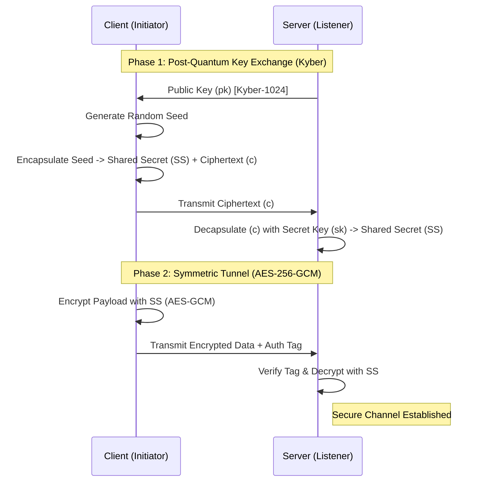

**Architect:** Bijan Arianlou | **Role:** Principal Systems Architect
**Status:** Reference Implementation (v1.1) | **Core Logic:** Hybrid Key Encapsulation (KEM)

---

## 1. Architectural Intent
Sypher is a modular cryptographic framework designed to secure data transport against future quantum-decryption threats ("Store Now, Decrypt Later"). It implements a **Hybrid Protocol**, combining NIST-standardized Post-Quantum algorithms (Kyber) for key encapsulation with battle-tested symmetric encryption (AES-256-GCM) for payload transport.

## 2. Protocol Sequence (The Handshake)
The system utilizes a "Key Encapsulation Mechanism" (KEM) to establish a shared secret over an insecure channel, bypassing the vulnerabilities of RSA/ECC.

### Cryptographic Flow (Live Render)

### Core Capabilities
*   **Quantum Resistance:** Utilizes Kyber-1024 (NIST PQC Winner).
*   **Forward Secrecy:** Ephemeral key generation.
*   **Hybrid Architecture:** Merges AES speed with Lattice security.

---

## Implementation Notice
This repository serves as a **Reference Architecture**.
> *Contact the Architect for integration documentation.*
