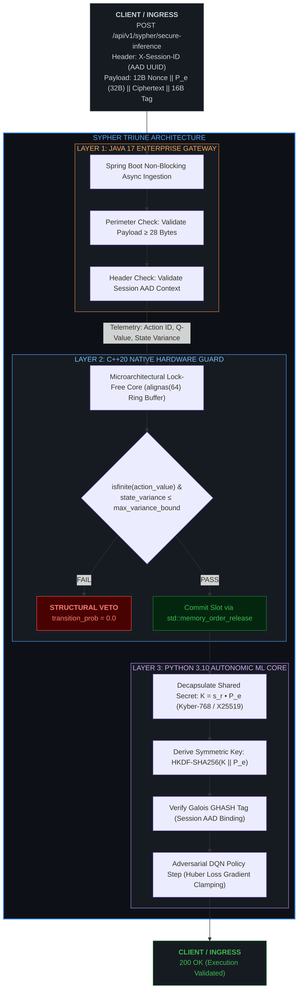

# SYPHER: Post-Quantum Cryptographic Intelligence & Routing Engine

**Architect:** Bijan Arianlou  
**Role:** Principal Systems Architect  
**Status:** Reference Implementation (v1.1)  
**Core Logic:** Hybrid Key Encapsulation (KEM) + Deep Q-Network (DQN) Routing

---

## 1. Architectural Intent

Sypher is a modular, reinforcement-driven cryptographic framework engineered to secure data transport against future quantum-decryption threats (“Store Now, Decrypt Later”). Unlike static cryptographic libraries, Sypher incorporates an autonomic **Deep Q-Network (DQN)** that continuously optimizes cryptographic routing under adversarial conditions such as DDoS floods, quantum-harvesting telemetry, and high-variance network volatility.

The system implements a hybrid protocol combining:

- **ML-KEM / Kyber-768** profile for post-quantum key encapsulation  
- **AES-256-GCM** for authenticated payload transport  
- **HKDF-SHA256** for deterministic secret expansion  

All governed by the **Hybrid_PQC_Evaluation** invariant:

> **Viability_Score** = (w₁ · Security_Level) − (w₂ · Latency_Overhead) − (w₃ · Size_Overhead)

---

## 2. Language & System Integration (Triune Stack)

### Python 3.10 — Autonomic ML Core

- TensorFlow (DQN policy backbone)  
- Gymnasium (MDP simulation)  
- Cryptography (AES-GCM, HKDF, X25519/Kyber primitives)  
- Implements adversarial training, Bellman updates, and state-space clamping.

### Java 17 — Enterprise Integration Gateway

- Spring Boot asynchronous REST/Kafka ingestion  
- Non-blocking `CompletableFuture` pipelines  
- High-throughput ingestion of encrypted state vectors  
- Enforces geometric payload boundaries (28-byte minimum envelope) and session-context fidelity.

### C++20 — Native Hardware Guard

- Zero-allocation, cache-aligned (64-byte) atomic ring buffers  
- Enforces **Structural_Veto_Gate** and **Bayesian_Dampener** at L1/L2 cache speed  
- Deterministic O(1) memory residency  
- Hardware-level veto against variance spikes and non-finite tensor outputs.

---

## 3. Protocol Sequence (The Handshake)

Sypher establishes secure channels using a **Key Encapsulation Mechanism (KEM)** rather than RSA/ECC. The RL agent continuously evaluates threat telemetry and latency to select optimal encapsulation strategies.

**Flow:**

1. Ephemeral PQC / X25519 keypair generation  
2. Kyber-768 baseline encapsulation  
3. HKDF-SHA256 expansion with transcript binding  
4. AES-256-GCM authenticated encryption (28-byte minimum envelope)  
5. RL-driven routing and scheme rotation

```mermaid
graph TD
    Client["<b>CLIENT / INGRESS</b><br/>POST /api/v1/sypher/secure-inference<br/>Header: X-Session-ID (AAD UUID)<br/>Payload: 12B Nonce || P_e (32B) || Ciphertext || 16B Tag"]

    subgraph Sypher["SYPHER TRIUNE ARCHITECTURE"]
        direction TB

        subgraph L1["LAYER 1: JAVA 17 ENTERPRISE GATEWAY"]
            A1["Spring Boot Non-Blocking Async Ingestion"]
            A2["Perimeter Check: Validate Payload &ge; 28 Bytes"]
            A3["Header Check: Validate Session AAD Context"]
            A1 --> A2 --> A3
        end

        subgraph L2["LAYER 2: C++20 NATIVE HARDWARE GUARD"]
            B1["Microarchitectural Lock-Free Core (alignas(64) Ring Buffer)"]
            B2{"isfinite(action_value) &amp;<br/>state_variance &le; max_variance_bound"}
            B_Veto["<b>STRUCTURAL VETO</b><br/>transition_prob = 0.0"]
            B_Pass["Commit Slot via std::memory_order_release"]

            B1 --> B2
            B2 -- FAIL --> B_Veto
            B2 -- PASS --> B_Pass
        end

        subgraph L3["LAYER 3: PYTHON 3.10 AUTONOMIC ML CORE"]
            C1["Decapsulate Shared Secret: K = s_r &bull; P_e (Kyber-768 / X25519)"]
            C2["Derive Symmetric Key: HKDF-SHA256(K || P_e)"]
            C3["Verify Galois GHASH Tag (Session AAD Binding)"]
            C4["Adversarial DQN Policy Step (Huber Loss Gradient Clamping)"]

            C1 --> C2 --> C3 --> C4
        end

        A3 -- "Telemetry: Action ID, Q-Value, State Variance" --> B1
        B_Pass --> C1
    end

    Validated["<b>CLIENT / INGRESS</b><br/>200 OK (Execution Validated)"]

    Client --> A1
    C4 --> Validated

    style Client fill:#161b22,stroke:#30363d,stroke-width:1px,color:#c9d1d9
    style Validated fill:#161b22,stroke:#238636,stroke-width:1px,color:#3fb950
    style Sypher fill:#0d1117,stroke:#388bfd,stroke-width:2px,color:#58a6ff
    style L1 fill:#161b22,stroke:#f0883e,stroke-width:1px,color:#ffa657
    style L2 fill:#161b22,stroke:#58a6ff,stroke-width:1px,color:#79c0ff
    style L3 fill:#161b22,stroke:#bc8cff,stroke-width:1px,color:#d2a8ff
    style B_Veto fill:#490202,stroke:#f85149,stroke-width:1px,color:#ff7b72
    style B_Pass fill:#04260f,stroke:#238636,stroke-width:1px,color:#3fb950
```

## 4. Core Capabilities

- **Quantum Resistance:** Kyber-768 lattice-based KEM profile with optional X25519 hybridization.  
- **Forward Secrecy:** Ephemeral secrets + deterministic HKDF expansion.  
- **Autonomic Adversarial Defense:** DQN-driven scheme rotation, Huber-loss stabilization, and state-space clamping.  
- **Absolute Data Supremacy:** AES-256-GCM AEAD binds payloads to session-specific AAD, neutralizing replay vectors.  
- **Deterministic Hardware Guardrails:** C++20 atomic ring buffers enforce nanosecond-level veto decisions.

---

## 5. Implementation Notice

This repository is a **Reference Architecture**.  
Direct use of raw cryptographic primitives in production environments requires formal review.

For enterprise integration, native C++ bindings, or deployment documentation:  
**Contact the Architect.**

---

## 6. Repository Structure (Triune Layout)
/ml-engine              # Python DQN + PQC cryptographic core
/java-gateway           # Spring Boot REST/Kafka ingestion layer
/native_cpp             # C++20 hardware guard (zero-allocation, lock-free)
/tests                  # Deterministic SCIENTIFIC_VALIDATION suite
Dockerfile              # Polyglot container architecture
requirements.txt        # Deterministic dependency graph
